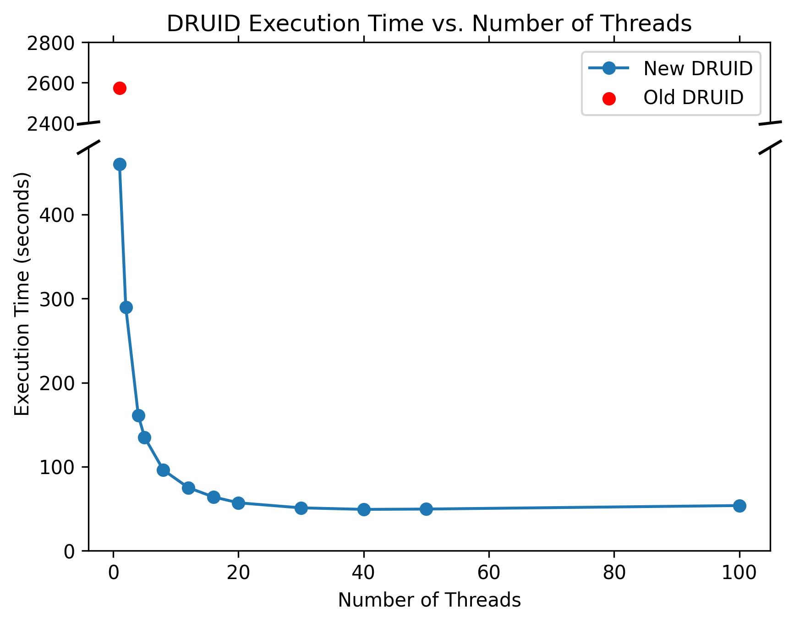

# DRUID
[](https://github.com/RhysAlfShaw/DRUID/actions/workflows/pytest.yaml)
[](https://codecov.io/gh/RhysAlfShaw/DRUID)

DRUID is a general-purpose source finder for optical and radio images written in Python, applicable to a broad range of scenarios. 

DRUID relies on the use of persistent homology to find sources and nested components within an image. This information is then processed as described in Shaw et al. (2025). 

Currently, DRUID uses the [`cripser`](https://github.com/shizuo-kaji/CubicalRipser_3dim) library to calculate the persistence of homology groups within 2D data.

## Versions

This is the newly parallelized version of DRUID, featuring improved background data handling. The version of DRUID used in Shaw et al. (2025) can be found in the [releases]().

### Notes on the new version
- DRUID's architecture has been significantly updated to allow for highly efficient parallelization.
- Pandas DataFrames have been replaced with Polars, drastically improving compute speed and memory management.
- GPU usage has been removed, as it was incompatible with the new parallel strategy.

These changes have increased DRUID's speed by roughly 5-60x. This improvement stems from the new processing architecture and the switch to Polars, with further gains driven by parallelization. To get an idea of its new performance, check out the scaling plot below. This benchmark reflects the processing of an optical image with 0.1" resolution over a 0.57 deg² field of view, containing around 100,000 sources.



## Installation

Currently, the best way to use DRUID is to clone this repository and install it along with its dependencies:

```bash
git clone https://github.com/RhysAlfShaw/DRUID.git
cd DRUID
```

### Conda

Create conda environement:
```bash
conda env create -f environment.yml
```

```bash
pip install .
```

You can then verify the installation by running:

```python
from DRUID import sf
```
### UV

For a faster install with a single command using uv, simply.

```bash
uv sync --python 3.12
```

uv will automatically detect the requirements and install DRUID. Test as above or with

```bash
uv run python -c "from DRUID import sf"
```

No errors indicates a successful install.


### Note for Apple Silicon Users
`cripser` does not provide compiled binaries for Apple Silicon, so you will need to compile the library locally. This can typically be done with the following command:

```bash
pip install -U git+[https://github.com/shizuo-kaji/CubicalRipser_3dim](https://github.com/shizuo-kaji/CubicalRipser_3dim)
```

Any installation errors at this stage will likely stem from the version of CMake or the C compilers you have installed. See the [CubicalRipser_3dim repository](https://github.com/shizuo-kaji/CubicalRipser_3dim) for further details on required compilers.

## Using DRUID

To run DRUID, follow these steps:

1. **Initialize the `sf` (source finding) object:**
```python
findmysource = sf(
        image=image,           # image, either a 2d np.array, or path to fits file.
        mode="optical",        
        area_limit=5,          # Helps remove noise sources.
        smooth_sigma=1,        # smooth image before ph analysis, fluxes measured on original image.
        num_threads=2,         # number of threads, as num_threads increases speed gains decrease.
        chunksize=20,          # chuncking size for multithreading, only provides minor speedup.
        max_area_limit = 1E5,  # there are size limits on ph analysis this prevent unintentional infinate compute time.
        working_directory=".", # where to save outputs and cache results.
        cache=False,           # Cache/save results to working directory.
    )
```

2. **Define the background:**
```python
findmysource.set_background(
        method='mad_std',       # background statistic (sex,rms,mad_std...)
        detection_threshold=5,  # how many sigmas above the background should we call a source.
        analysis_threshold=3,   # ^^^^^^^^^^^^^^^^^^^^^^^^^^^^^^^^^^^^^^^^^^^ we analyse for a source.
        box_size=10 # boz size for creating a background map.
    )
```

3. **Find and deblend sources using Persistent Homology:**
```python
findmysource.phsf(,
    lifetime_limit = 0,          # float value for this limit
    lifetime_limit_fraction=1.2  # fraction based on birth and death.
    )
```

This function also calculates source properties.


## Runnig in parallel.

To prevent issues with pythons multiprocessing functionality. DRUID will not run unless wrapped in a __main__. If you run this inside a jupyter notebook __main__ is not necessary.

```python
from DRUID import sf

def main():
    findmysource = sf(
        image=image,           
        mode="optical",        
        area_limit=5,          
        num_threads=2,          
    )
    findmysource.set_background()
    findmysource.phsf()

if __name__ == "__main__":
    main()

```

## Bugs & Issues

Please report any bugs or issues you encounter while using DRUID on this repository's [Issues](#) page. Thank you!

or email me at [rhys.shaw@bristol.ac.uk](mailto:rhys.shaw@bristol.ac.uk).

## Acknowledgements

If you use DRUID for your research, please cite: 
> [Shaw et al. 2025](https://doi.org/10.1093/rasti/rzaf006)